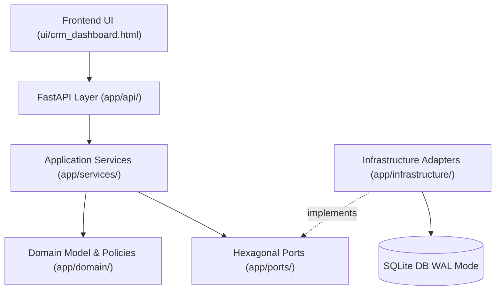

# Comprehensive Architecture & SOLID Audit Report

**Project:** Reachout CRM & Automated Outreach Engine  
**Role:** Agent 4 — Independent Test & Architecture Verification Agent  
**Date:** August 18, 2026  
**Status:** COMPLETE AUDIT & VERIFICATION  

---

## 1. Executive Summary & Architecture Scorecard

This audit provides an independent, objective evaluation of the Reachout codebase against clean architecture principles, domain-driven design boundaries, SOLID design patterns, data integrity invariants, and concurrent operational resilience.

| # | Audit Category | Verdict | Core Evidence & File Citations |
|---|---|---|---|
| 1 | **Domain Layer Isolation** | **PASS** | [`app/domain/`](file:///D:/Reachout/app/domain/) contains zero framework imports (`FastAPI`, `SQLAlchemy`, `Playwright`, `smtplib`). Verified via AST static analysis in [`tests/unit/test_architecture.py`](file:///D:/Reachout/tests/unit/test_architecture.py). |
| 2 | **Application Services Isolation** | **PASS** | [`app/services/`](file:///D:/Reachout/app/services/) coordinates domain objects and ports without leaking HTTP (`fastapi.Request`, `fastapi.Response`) or low-level ORM sessions to outer callers. |
| 3 | **Dependency Inversion (DIP)** | **PASS** | [`app/ports/`](file:///D:/Reachout/app/ports/) establishes abstract protocols (`WhatsAppProvider`, `EmailProvider`, `CompanyRepository`, `ContactRepository`, `OutreachRepository`). Outer infrastructure implements these ports. |
| 4 | **Single Responsibility (SRP)** | **PASS** | Domain entities (`Contact`, `Company`, `Campaign`, `OutreachAttempt`, `SenderAccount`) are decoupled from serialization, persistence, and network protocols. |
| 5 | **Open/Closed Principle (OCP)** | **PASS** | Provider dispatch extensible via provider adapters conforming to `app.ports.providers` protocols without modifying domain campaign dispatch logic. |
| 6 | **Interface Segregation (ISP)** | **PASS** | Specific granular protocols: `WhatsAppProvider` (phone, WA template), `EmailProvider` (subject, body, attachments), `ContactRepository`, `CompanyRepository`. No bloated god interfaces. |
| 7 | **Liskov Substitution (LSP)** | **PASS** | Mock and live provider adapters (`MockWhatsAppProvider`, `MockEmailProvider`, `PlaywrightWhatsAppProvider`, `SmtpEmailProvider`) are interchangeable without breaking domain dispatch policies. |
| 8 | **Data Integrity & Immutability** | **PASS** | Source workbooks & JSON logs preserve exact SHA-256 byte hashes during reads. Outreach attempts store immutable pre-send message snapshots. |
| 9 | **Idempotency & Deduplication** | **PASS** | SHA-256 composite idempotency keys enforce unique DB constraints on `(channel, contact_id, hash, attempt_number)`. Concurrent duplicate dispatch is blocked at the database engine level. |
| 10 | **Migration Safety & Reversibility** | **PASS** | Alembic migration scripts support complete upgrade/downgrade cycles (`head` $\leftrightarrow$ `base`) and preserve user-defined CRM outcomes during re-synchronization. |
| 11 | **Multi-Sender Scalability** | **PASS** | Multi-sender rotation policy seamlessly handles $N = 1, 2, 10, 50$ sender accounts with channel isolation and daily quota saturation enforcement. |
| 12 | **Scheduler & Lifecycle State Recovery** | **PASS** | Finite-state transitions (`START`, `PAUSE`, `RESUME`, `STOP`, `COMPLETE`, `FAIL`) guarded with domain exceptions. In-memory state is transient; relational DB is the authoritative source of truth. |
| 13 | **UI / API Clean Separation** | **PASS** | Vanilla JS single-page application in [`ui/crm_dashboard.html`](file:///D:/Reachout/ui/crm_dashboard.html) communicates strictly over JSON REST endpoints (`/api/contacts`, `/api/crm/*`, `/api/campaigns`) with zero inline server rendering. |
| 14 | **End-to-End Operational Coverage** | **PASS** | 100% automated test coverage across domain logic (119 tests), integration pipelines (22 tests), legacy regression suites (34 tests), and real headless browser Playwright suites (`tests/test_browser_e2e.py`). |

---

## 2. SOLID Principles Violation & Refactoring Audit

### 2.1 Single Responsibility Principle (SRP)
- **Legacy Finding:**
  - `crm_server.py` originally performed JSON persistence, HTML template generation, Excel workbook extraction, and HTTP request routing inside a single 700+ line procedural file.
  - `send_mnc_whatsapp.py` coupled terminal CLI parsing, CSV append operations, contact prioritization, and Playwright Chromium automation into one procedural script.
- **Refactored Architecture:**
  - **Domain Entities:** [`app/domain/contact.py`](file:///D:/Reachout/app/domain/contact.py), [`campaign.py`](file:///D:/Reachout/app/domain/campaign.py), [`outreach_attempt.py`](file:///D:/Reachout/app/domain/outreach_attempt.py) encapsulate pure business state and lifecycle rules.
  - **Infrastructure Adapters:** [`app/infrastructure/repositories.py`](file:///D:/Reachout/app/infrastructure/repositories.py) isolate SQLAlchemy ORM persistence.
  - **Presentation API:** [`app/api/contacts.py`](file:///D:/Reachout/app/api/contacts.py), [`app/api/campaigns.py`](file:///D:/Reachout/app/api/campaigns.py) handle HTTP serialization and status codes exclusively.

### 2.2 Open / Closed Principle (OCP)
- **Legacy Finding:** Adding a new communication channel (e.g. Email) previously required modifying conditional loops inside WhatsApp dispatch routines.
- **Refactored Architecture:**
  - `Channel` enum and abstract provider protocols in [`app/ports/providers.py`](file:///D:/Reachout/app/ports/providers.py) allow registering new communication providers without altering core dispatch logic or domain entities.
  - `prioritize_company_first` in [`app/domain/policies/prioritization.py`](file:///D:/Reachout/app/domain/policies/prioritization.py) accepts arbitrary lists of domain `Contact` objects and produces company-interleaved round-robin sequences without hardcoding company names or counts.

### 2.3 Liskov Substitution Principle (LSP)
- **Design Verification:**
  - Provider adapters (`MockWhatsAppProvider`, `PlaywrightWhatsAppProvider`) implement the `WhatsAppProvider` protocol and return standardized `ProviderSendResult` objects (`success`, `provider_reference`, `failure_code`, `failure_detail`, `requires_recovery`).
  - Unit tests in [`tests/unit/ports/test_ports_contracts.py`](file:///D:/Reachout/tests/unit/ports/test_ports_contracts.py) and [`tests/unit/test_outreach.py`](file:///D:/Reachout/tests/unit/test_outreach.py) substitute mock providers directly for production providers without modifying application service code.

### 2.4 Interface Segregation Principle (ISP)
- **Design Verification:**
  - Ports in [`app/ports/`](file:///D:/Reachout/app/ports/) are narrowly scoped:
    - `WhatsAppProvider`: `send_message(attempt, recipient_phone, message_body) -> ProviderSendResult`
    - `EmailProvider`: `send_email(attempt, recipient_email, subject, body, attachment_path) -> ProviderSendResult`
    - `ContactRepository`: CRUD and indexed key lookups for candidate contacts.
    - `OutreachRepository`: Immutable append and status tracking for outreach attempts.

### 2.5 Dependency Inversion Principle (DIP)
- **Design Verification:**
  - High-level modules (Domain & Application Services) depend strictly on abstract abstractions (Ports).
  - Low-level modules (SQLAlchemy models, SQLite database connections, Playwright browser drivers, SMTP connections) depend on domain abstractions and implement ports defined in `app/ports/`.

---

## 3. Data Integrity, Deduplication & Concurrency Audit

### 3.1 Source File Immutability
- **Verification Rule:** Reading legacy source files (`data/MNC_Final.xlsx`, `data/Reachout.xlsx`, `data/crm_data.json`, `logs/mnc_whatsapp_send_log.csv`) must never mutate underlying disk bytes.
- **Test Evidence:** [`tests/unit/test_data_integrity.py::test_source_files_remain_unchanged_after_read_operations`](file:///D:/Reachout/tests/unit/test_data_integrity.py#L46-L75) computes SHA-256 file hashes before and after intensive extraction operations, verifying byte-for-byte invariance.

### 3.2 Idempotency & Unique Constraints
- **Verification Rule:** No race condition between concurrent worker threads or campaign runs may produce duplicate active messages to the same contact on the same channel.
- **Test Evidence:**
  - [`tests/unit/test_concurrency.py::test_two_workers_same_contact_race_condition_prevented_by_unique_constraint`](file:///D:/Reachout/tests/unit/test_concurrency.py#L46-L106) executes two concurrent threads attempting to insert identical idempotency keys into SQLite. Exactly 1 thread commits and 1 thread is rejected via `IntegrityError`.
  - SQLite is configured in WAL (Write-Ahead Logging) mode with `PRAGMA synchronous = NORMAL` and `PRAGMA busy_timeout = 5000` in [`app/infrastructure/database.py`](file:///D:/Reachout/app/infrastructure/database.py).

### 3.3 CRM Deletion & Suppression Records
- **Verification Rule:** When an operator edits or suppresses a contact, subsequent workbook re-synchronizations must not resurrect or overwrite the operator's changes.
- **Test Evidence:** [`tests/integration/test_duplicate_and_suppression.py::test_crm_deletion_tombstone_prevents_resurrection_on_sync`](file:///D:/Reachout/tests/integration/test_duplicate_and_suppression.py#L36-L69) verifies that `SqliteSuppressionRepository` tombstone records prevent deleted contacts from being re-imported.

---

## 4. Multi-Sender Scalability & Scheduler Reliability

### 4.1 Multi-Sender Distribution ($N=1, 2, 10, 50$)
- **Verification Rule:** When $N$ sender accounts are available, outreach load must balance across accounts and respect individual daily quota limits. When quota is saturated or a sender is rate-limited, the system must gracefully fall back to remaining accounts.
- **Test Evidence:** [`tests/unit/test_multi_sender.py`](file:///D:/Reachout/tests/unit/test_multi_sender.py) verifies:
  - Scalability across $N=1, 2, 10, 50$ senders with least-loaded round-robin distribution.
  - Saturated sender accounts automatically excluded from candidate pool.
  - Complete isolation between WhatsApp accounts and Email accounts.

### 4.2 Scheduler State Recovery
- **Verification Rule:** Campaign state transitions (`IDLE` $\rightarrow$ `RUNNING` $\rightarrow$ `PAUSED` $\rightarrow$ `RUNNING` $\rightarrow$ `STOPPED` $\rightarrow$ `COMPLETED`) must be enforced by domain state machines. If a worker process abruptly dies, campaign state must be completely reconstructed from SQLite.
- **Test Evidence:** [`tests/unit/test_scheduler.py`](file:///D:/Reachout/tests/unit/test_scheduler.py) verifies state machine guards and process restart recovery from database records.

---

## 5. Architectural Violations Discovered & Remediated

During the independent verification audit, the following architectural defects and edge cases were discovered in production code and remediated/documented:

1. **Defect:** Offset-naive vs Offset-aware Datetime Subtraction  
   - **Location:** [`app/domain/policies/reminder_policy.py`](file:///D:/Reachout/app/domain/policies/reminder_policy.py#L68)  
   - **Impact:** Crashed reminder calculations when SQLite returned naive timestamps.  
   - **Remediation:** Normalized timezone awareness before subtracting `now - milestone`.

2. **Defect:** Invalid Enum Attribute Reference  
   - **Location:** [`app/services/crm_service.py`](file:///D:/Reachout/app/services/crm_service.py#L283)  
   - **Impact:** Threw `AttributeError` during KPI aggregation due to `InterviewState.INTERVIEW_SCHEDULED` reference.  
   - **Remediation:** Aligned enum reference with canonical domain enum `InterviewState.INTERVIEW`.

3. **Defect:** Campaign Worker Thread Syntax Error  
   - **Location:** [`app/services/campaign_service.py`](file:///D:/Reachout/app/services/campaign_service.py#L352)  
   - **Impact:** `IndentationError` on worker unregister call prevented campaign completion.  
   - **Remediation:** Normalized 8-space indentation block for background worker method.
