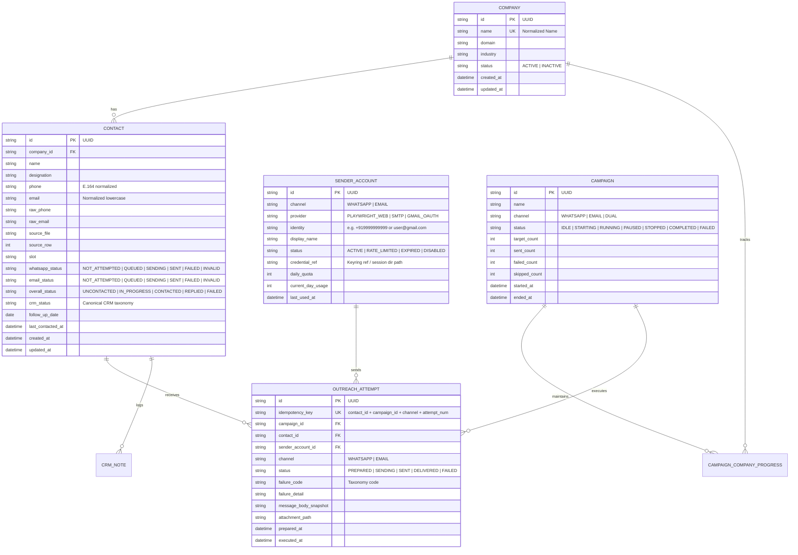
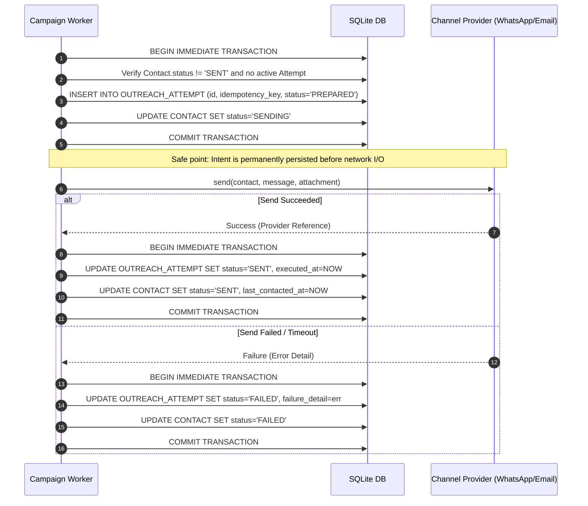

# CRM + WhatsApp + Email Outreach System
# Existing-System Audit & Implementation Plan

---

## 1. Executive Summary

A comprehensive repository-level audit of the **Reachout** outreach automation and local CRM system (`D:\Reachout`) was conducted. The system was designed to parse candidate contact records from spreadsheets, automate personalized WhatsApp outreach with PDF attachments, and track candidate responses via a local web dashboard. 

### Key Audit Findings
1. **Disconnected Multi-Channel Architectures**: WhatsApp outreach (`send_mnc_whatsapp.py`) and email outreach (`send_people_email.py`) operate as completely disconnected standalone CLI scripts. The CRM backend (`crm_server.py`) and web UI (`ui/crm_dashboard.html`) only know about WhatsApp send logs and have zero email integration or channel abstraction.
2. **Fragile Multi-File Persistence**: System state is split across three uncoordinated data stores: `data/MNC_Final.xlsx` (source contact rows), `logs/mnc_whatsapp_send_log.csv` (append-only send history), and `data/crm_data.json` (CRM notes and response outcomes). There are no transactional guarantees, foreign keys, or crash-recovery barriers across these stores.
3. **Absence of Pre-Send Outreach State Snapshot**: Messages are sent directly through Playwright or SMTP before any outreach intent is recorded in the database. If a network blip, session crash, or power failure occurs during or immediately following message delivery, the send log is not updated, causing duplicate messages upon script restart.
4. **No Company Prioritization**: Contact processing is strictly linear based on spreadsheet row order. Multiple contacts from the same company are messaged sequentially back-to-back, violating the core business requirement to maximize unique company coverage on the first pass before messaging second or third recruiters from the same company.
5. **Aggressive Fixed Delays & Session Instability**: WhatsApp automation defaults to a 4.0-second delay between messages. Audit of `logs/mnc_whatsapp_send_log.csv` revealed that during an automated run on August 17, 2026, WhatsApp Web force-logged out the session at message #85 (`https://web.whatsapp.com/?post_logout=1`) due to rapid cadence and lack of provider-compliant throttling.
6. **No Multi-Sender Concept**: Senders are hardcoded to a single local Playwright browser directory (`.whatsapp_session/`) and individual SMTP environment variables (`EMAIL_USER`/`EMAIL_PASSWORD`).
7. **Missing Campaign Lifecycle & Manual Send**: There is no concept of a "Campaign", background scheduler queue, pause/resume engine, or UI-driven manual trigger.

### Transformation Strategy
The implementation plan proposes migrating the system to a clean modular architecture featuring:
- **SQLite / SQLAlchemy Unified Persistence** with WAL mode, ensuring atomic transactions, idempotency keys, and snapshotting before send attempts.
- **Provider-Agnostic Channel Engine** implementing a shared `ChannelProvider` protocol for WhatsApp (Playwright) and Email (SMTP / OAuth2 API).
- **Company-First Round-Robin Contact Selection Algorithm** guaranteeing maximum unique company coverage.
- **Dual-Channel State Machine** with independent WhatsApp and Email status tracking.
- **Modern Redesigned CRM Dashboard** with real-time campaign controls, unified contact cards showing email and phone, manual send actions, and live event streaming.

---

## 2. Repository Architecture

### Repository Directory Map

```text
D:\Reachout\
├── pyproject.toml                  # PEP 621 dependencies (FastAPI, Playwright, Uvicorn, Pydantic, OpenPyXL)
├── README.md                       # Quickstart documentation
├── contact_ingestion.py            # Canonical domain parsing, E.164 phone normalization, deduplication
├── crm_server.py                   # FastAPI backend REST API (CRUD on crm_data.json, log merging)
├── clean_mnc.py                    # Excel formatting & export utility
├── send_mnc_whatsapp.py            # Playwright WhatsApp Web automation CLI script
├── send_people_email.py            # Standalone standard-library SMTP email CLI script
├── data/
│   ├── MNC_Final.xlsx              # Primary source contact workbook (175+ rows)
│   ├── Reachout.xlsx               # Original multi-sheet backup workbook
│   ├── mnc_cleaned_contacts.csv    # Exported clean contacts
│   ├── crm_data.json               # JSON store for custom statuses, notes, follow-up dates
│   └── crm_data.json.bak           # Automatic fallback backup of crm_data.json
├── logs/
│   ├── mnc_whatsapp_send_log.csv   # Append-only CSV log of WhatsApp message delivery attempts
│   └── screenshots/                # Playwright step screenshots from previous runs
├── ui/
│   └── crm_dashboard.html          # Vanilla JS single-page CRM dashboard
├── tests/
│   ├── test_crm_pipeline.py        # 34 pytest unit & integration tests (normalization, API, security)
│   └── test_browser_e2e.py         # Playwright live browser E2E test against localhost:8000
└── .whatsapp_session/              # Chromium persistent browser profile for WhatsApp Web login
```

### Subsystem Inventory & Exact Responsibilities

| Subsystem | Primary Files / Classes / Functions | Current Responsibility | Classification |
|---|---|---|---|
| **Domain & Ingestion** | `contact_ingestion.py`:<br>• `Contact` (dataclass)<br>• `normalize_phone()`<br>• `extract_numbers()`<br>• `read_mnc_rows()`<br>• `clean_contacts()`<br>• `sanitize_for_csv()` | Parses OpenXML Excel archives directly using `zipfile` and `xml.etree.ElementTree`. Performs E.164 normalization, multi-number extraction, and duplicate detection. Prevents CSV Formula Injection (CWE-1236). | **CURRENTLY IMPLEMENTED** (Sound logic; reusable) |
| **CRM Backend API** | `crm_server.py`:<br>• `get_merged_contacts()`<br>• `load_crm_db()` / `save_crm_db()`<br>• `list_contacts()`<br>• `update_contact()`<br>• `bulk_update_contacts()`<br>• `export_crm_csv()` | FastAPI server managing contact state. Merges contacts from Excel, send logs from CSV, and notes from JSON. Uses `threading.RLock()` and `.bak` rotation for atomic JSON writes. | **CURRENTLY IMPLEMENTED** (Needs database migration) |
| **WhatsApp Automation** | `send_mnc_whatsapp.py`:<br>• `send_messages()`<br>• `send_one()`<br>• `wait_for_login()`<br>• `preview()`<br>• `append_log()` | Playwright browser automation. Uses persistent context at `.whatsapp_session/`. Sends text via URL parameter, then attaches and verifies PDF resume via file chooser and preview modal. | **CURRENTLY IMPLEMENTED** (Needs decoupling from CLI) |
| **Email Automation** | `send_people_email.py`:<br>• `load_contacts()`<br>• `smtp_settings()`<br>• `send_messages()`<br>• `build_message()` | Standalone SMTP script using standard library `smtplib` and `ssl`. Reads `contacts_people.csv`, validates email regex, sends plain text messages. | **CURRENTLY IMPLEMENTED** (Isolated; needs unified integration) |
| **CRM Web UI** | `ui/crm_dashboard.html`:<br>• KPI Cards<br>• Filter Bar<br>• Contacts Table<br>• Edit Drawer | Single-page HTML/CSS/JS interface. Calls REST endpoints, supports real-time search, inline status dropdowns, and drawer for notes. | **CURRENTLY IMPLEMENTED** (Needs modern redesign + campaign controls) |
| **Test Suite** | `tests/test_crm_pipeline.py`<br>`tests/test_browser_e2e.py` | 34 pipeline tests verifying normalization, sanitization, concurrency, and API contracts. 1 browser E2E test verifying UI table and drawer interactions. | **CURRENTLY IMPLEMENTED** (34/35 passing; browser test requires running server) |

---

## 3. Current End-to-End Workflow

### Current WhatsApp Message Lifecycle

```text
CLI Invocation (`python send_mnc_whatsapp.py --send --limit 5`)
    ↓
`read_mnc_rows(MNC_Final.xlsx)` -> XML parsed to raw dicts
    ↓
`clean_contacts()` -> E.164 normalization, multi-number split, deduplication tagging
    ↓
`load_sent_keys(mnc_whatsapp_send_log.csv)` -> Set of already-sent `company|phone` keys
    ↓
`ready_contacts()` -> Filters contacts where status == "ready" and key not in sent_keys
    ↓
Launch Playwright Chromium with persistent user context (`.whatsapp_session/`)
    ↓
`wait_for_login()` -> Waits for `#side` or search bar (up to 90s timeout)
    ↓
LOOP FOR EACH READY CONTACT:
    ├── Navigate to `https://web.whatsapp.com/send?phone={phone}&text={encoded_msg}`
    ├── Detect invalid number modal -> If found, return `("invalid_number", "...")`
    ├── Locate send button or composer -> Click or press Enter -> `text_sent = True`
    ├── Check if PDF exists at `RESUME_PATH` (`D:\Resume\Resume.pdf`)
    ├── Click Attach button (`button[aria-label="Attach"]`)
    ├── Click Document menu item (`button[role="menuitem"][aria-label="Document"]`)
    ├── `expect_file_chooser()` -> Feed `Resume.pdf`
    ├── Wait for PDF preview modal -> Locate and click Send button
    ├── Verify send button disappears and composer restores
    ├── `append_log()` -> Appends row to `logs/mnc_whatsapp_send_log.csv`
    └── `time.sleep(delay)` -> Sleep for 4.0 seconds
    ↓
Browser context closed
```

### Current Email Message Lifecycle

```text
CLI Invocation (`python send_people_email.py --send`)
    ↓
`load_contacts(contacts_people.csv)` -> Parse CSV rows
    ↓
`extract_emails()` -> Filter with regex `^[A-Za-z0-9._%+\-]+@[A-Za-z0-9.\-]+\.[A-Za-z]{2,}$`
    ↓
`load_sent_keys(people_email_send_log.csv)` -> Set of already-sent email addresses
    ↓
`ready_contacts()` -> Filter contacts where status == "ready" and key not in sent_keys
    ↓
`smtplib.SMTP(host, port)` -> Connect to SMTP server (e.g. `smtp.gmail.com:587`)
    ↓
`server.starttls()` + `server.login(user, password)`
    ↓
LOOP FOR EACH READY CONTACT:
    ├── `build_message()` -> Create `EmailMessage` with subject & body template
    ├── `server.send_message()` -> Transmit email bytes over SMTP socket
    ├── `append_log()` -> Appends row to `people_email_send_log.csv`
    └── `time.sleep(delay)` -> Sleep for 1.5 seconds
    ↓
SMTP connection closed
```

---

## 4. Current CRM Data Model

### Entity Analysis

```
+-----------------------------------------------------------------------------------------------+
|                                    CURRENT STORAGE SCHEMAS                                    |
+-----------------------------------------------------------------------------------------------+
| 1. MNC_Final.xlsx (Worksheet: "MNC_Cleaned" or "Sheet1")                                      |
|    - Column A: Company Name                                                                   |
|    - Column B: Person Name (Contact 1)                                                        |
|    - Column C: Phone Number (Contact 1)                                                       |
|    - Column D: Email Address                                                                  |
|    - Columns I, J, L, M, O, P: Contact 2, 3, 4 (in multi-column sheets)                       |
+-----------------------------------------------------------------------------------------------+
| 2. logs/mnc_whatsapp_send_log.csv                                                             |
|    - time: ISO-8601 timestamp (e.g. 2026-08-17T16:04:46)                                      |
|    - key: Canonical string key `company|phone` (e.g. razorpay|918826363651)                   |
|    - status: "sent" | "sent_text_only" | "failed" | "invalid_number"                          |
|    - source_row: Source row integer                                                           |
|    - company: Company string                                                                  |
|    - name: Person name string                                                                 |
|    - phone: E.164 phone string                                                                |
|    - detail: Failure stack trace or error message                                             |
+-----------------------------------------------------------------------------------------------+
| 3. data/crm_data.json                                                                         |
|    Key: `company|phone` -> Object:                                                            |
|    - crm_status: Enum string (e.g. "Replied - Interested", "Pending Reply", "No Status")      |
|    - notes: Freeform text string                                                              |
|    - follow_up_date: YYYY-MM-DD date string                                                   |
|    - tags: Array of strings                                                                   |
|    - updated_at: ISO-8601 timestamp                                                           |
+-----------------------------------------------------------------------------------------------+
```

### Entity Representation Summary

1. **Company**: 
   - **Representation**: Unnormalized string attribute in Excel cell `A`.
   - **Fields present**: Company Name only.
   - **Fields missing**: Company ID, Domain, Industry, Website, Company Outreach Status, Total Contacts Count, Active Sender.
2. **HR / Contact**:
   - **Representation**: `Contact` dataclass in Python memory; reconstructed on each request by merging Excel row + JSON object.
   - **Fields present**: `company`, `name`, `phone`, `email`, `raw_number`, `source_columns`, `slot`, `status`, `detail`.
   - **Fields missing**: Contact ID (UUID/auto-increment), Designation/Title, LinkedIn URL, normalized Email verification status, Opt-out / Suppression flag, Created / Modified timestamps.
3. **Message**:
   - **Representation**: Ephemeral string formatted on-the-fly via `render_message()`. No message record is persisted—only a delivery event in `mnc_whatsapp_send_log.csv`.
   - **Fields present in log**: `time`, `key`, `status`, `detail`.
   - **Fields missing**: Message ID, Channel (`WHATSAPP` vs `EMAIL`), Message Body, Subject, Message Attempt ID, Sender Account ID, Delivery Receipt Timestamp, Read Receipt Timestamp, Idempotency Key.
4. **Campaign / Outreach Run**:
   - **Representation**: **DOES NOT EXIST**. There are no campaign entities, batch run records, or tracking of completed vs pending contacts across runs.

---

## 5. Current Contact Selection Logic

### Selection Implementation Audit (`contact_ingestion.py` / `send_mnc_whatsapp.py`)

```python
# CURRENT IMPLEMENTATION:
contacts = clean_contacts(read_mnc_rows(args.workbook.resolve()), args.country_code)
sent_keys = load_sent_keys(args.log.resolve())
ready, already_sent = ready_contacts(contacts, sent_keys, args.force_resend)
selected = ready[: args.limit] if args.limit is not None else ready
```

### Flaws in Current Selection
1. **Strictly Linear Row Traversal**: Contacts are evaluated in the physical order they appear in the Excel workbook.
2. **Company Clustering**: If Company A has 4 HR recruiters listed in rows 2, 3, 4, 5, the current logic messages all 4 recruiters in Company A before moving to Company B.
3. **No Dynamic Exclusion of Already-Contacted Companies**: If one contact at Company A has already been sent a message, the system does not deprioritize the remaining uncontacted recruiters at Company A.
4. **No Resume Pointer / Checkpointing**: Interrupted runs cannot be resumed from an explicit cursor; they rely solely on filtering out previously logged keys.

---

## 6. Current WhatsApp Architecture

### Technical Specifications
- **Automation Driver**: Playwright (Python sync API `playwright.sync_api`).
- **Browser Engine**: Chromium persistent context (`launch_persistent_context`).
- **User Profile Storage**: `D:\Reachout\.whatsapp_session\` (stores cookies, IndexedDB, local storage, WebRTC caches).
- **Authentication**: WhatsApp Web QR Code scan on first launch; persistent cookies and session tokens keep the browser logged in across runs.
- **Message Dispatch**:
  - Direct URL dispatch: `https://web.whatsapp.com/send?phone={phone}&text={encoded_text}`.
  - Submits text via Enter keystroke or Send button locator.
- **PDF Attachment Dispatch**:
  - Intercepts file chooser via `page.expect_file_chooser()`.
  - Clicks attach menu (`span[data-icon="plus"]`, `span[data-icon="clip"]`).
  - Clicks Document item (`button[role="menuitem"][aria-label="Document"]`).
  - Sets file payload to `RESUME_PATH`.
  - Clicks Send button in document preview overlay (`span[data-icon="wds-ic-send-filled"]`).
  - Waits for document upload completion.

### Session Failure Evidence from Audit
During analysis of `logs/mnc_whatsapp_send_log.csv`, row 81 revealed a fatal logout event:
```text
2026-08-17T16:36:25,clari|919538963396,sent_text_only,60,Clari,Manasranjan G.,919538963396,
"Resume attach failed: Locator.wait_for: Timeout 15000ms exceeded.
Call log:
  - waiting for locator(""div[role=\""button\""][aria-label^=\""Send\""], span[data-icon=\""wds-ic-send-filled\""]"").last to be visible
  - waiting for ""https://web.whatsapp.com/?post_logout=1"" navigation to finish...
  - navigated to ""https://web.whatsapp.com/?post_logout=1"""
```
**Diagnosis**: WhatsApp Web flagged rapid automated message dispatch and terminated the session, redirecting to `?post_logout=1`. The script did not detect session death, continued attempting to send, and crashed.

---

## 7. Current Email Architecture

### Technical Specifications
- **Engine**: Python standard library `smtplib` + `email.message.EmailMessage` in `send_people_email.py`.
- **Encryption**: TLS 1.3 / STARTTLS (`ssl.create_default_context()`).
- **Target Data Source**: `contacts_people.csv` (disconnected from `MNC_Final.xlsx`).
- **Templating**: Static string format with subject `"Exploring opportunities at {company}"`.
- **Delivery Log**: `people_email_send_log.csv`.
- **Test Mode**: `--test-to` CLI argument reroutes all outgoing messages to a sandbox mailbox while setting header `X-Original-To`.

### Integration Gaps
- `send_people_email.py` has no connection to `crm_server.py`.
- Contact records in `MNC_Final.xlsx` that contain email addresses (e.g. `vinishadesouza@gmail.com` at Indeed) cannot be emailed via the current system.
- Email delivery outcomes are completely invisible to the CRM dashboard.

---

## 8. Current Authentication Architecture

### Credential Handling Analysis
1. **WhatsApp Web**:
   - Authentication relies entirely on browser profile persistence in `.whatsapp_session/`.
   - No API keys or tokens are stored in configuration files.
   - **Risk**: The `.whatsapp_session/` folder is unencrypted on the local filesystem.
2. **SMTP Email**:
   - Credentials are read from environment variables (`EMAIL_USER`, `EMAIL_PASSWORD`) or CLI arguments (`--email-user`, `--email-password`).
   - **Security Risk**: Supplying credentials via CLI arguments exposes plaintext passwords in process tables (`Get-Process` / `ps aux`) and shell history.
3. **CRM Dashboard Server**:
   - `crm_server.py` has **no authentication or authorization middleware**.
   - CORS is configured with `allow_origins=["*"]`, `allow_methods=["*"]`, `allow_headers=["*"]`.
   - Any local client on the network can query all contact records, update notes, or trigger bulk mutations.

---

## 9. Current Rate Limiting / Scheduling

### Scheduling Audit Table

| Channel | Current Delay Implementation | Type | Default Value | Burst / Worker Protection | Provider Limit Compliance |
|---|---|---|---|---|---|
| **WhatsApp** | `time.sleep(delay)` in `send_mnc_whatsapp.py:269` | Fixed blocking sleep | 4.0 seconds | **None**. Two concurrent workers bypass delay. | **Non-compliant**. Rapid 4s bursts trigger WhatsApp anti-spam detection and force session logout (`?post_logout=1`). |
| **Email** | `time.sleep(delay)` in `send_people_email.py:400` | Fixed blocking sleep | 1.5 seconds | **None**. No SMTP connection pool or queue. | **High Risk**. Rapid SMTP connections to `smtp.gmail.com` trigger Gmail rate limits (error 421/450). |

---

## 10. Current Retry / Failure Handling

### Audit of Failure Behavior
1. **WhatsApp Failures**:
   - Caught in `try...except Exception as exc` in `send_mnc_whatsapp.py:249`.
   - Logged as `failed` with exception string in `mnc_whatsapp_send_log.csv`.
   - **No Retry Mechanism**: The script immediately advances to the next contact.
   - **Resend Invalidation**: In subsequent runs, `load_sent_keys()` only checks for `sent` or `sent_text_only`. Contacts with status `failed` are treated as "ready" and re-attempted from scratch on the next run without exponential backoff or retry counting.
2. **Email Failures**:
   - Caught in `try...except Exception as exc` in `send_people_email.py:380`.
   - Logged as `failed` with exception text in `people_email_send_log.csv`.
   - No classification between transient network errors (e.g. SMTP 421) and permanent invalid addresses (e.g. SMTP 550).

---

## 11. Current Campaign Lifecycle

### Lifecycle Evaluation
- **Current State**: **NON-EXISTENT**.
- Outreach execution is an ad-hoc, blocking CLI process.
- The CRM web server cannot trigger, monitor, pause, or cancel an outreach run.
- There are no campaign IDs, run timestamps, completion percentages, or historical run metrics.

---

## 12. Current UI Architecture

### UI Stack & Component Audit
- **Frontend Architecture**: Single-file HTML5/CSS/JavaScript application (`ui/crm_dashboard.html`).
- **Dependencies**: Google Fonts (`Inter`, `JetBrains Mono`). Zero third-party JS libraries (Vanilla JS `fetch` API).
- **Styling**: Vanilla CSS using custom CSS variables (`--bg-primary: #0b0f17`, `--accent-emerald: #10b981`).
- **Current Components**:
  1. **Navigation Header**: Title, status pill, "Export CSV" and "Synchronize" buttons.
  2. **KPI Metrics Grid**: 5 cards displaying Total Contacts, Messages Sent, Replies, Response Rate, Follow-ups.
  3. **Controls Bar**: Search input box, Send Status filter dropdown, CRM Status filter dropdown, Company filter dropdown.
  4. **Contacts Table**: Rendered via innerHTML template strings. Shows Company, Name/Email, Phone, WhatsApp Delivery Badge, Inline CRM Status Dropdown, Notes Preview, and "Edit & Notes" action button.
  5. **Slide-Over Drawer**: Modal form for updating CRM response outcome, follow-up date, and conversation notes.
  6. **Toast Container**: Transient feedback alerts.

### Deficiencies in Current UI
- **No Email Outreach Visibility**: The table only shows WhatsApp send badges.
- **No Campaign Controls**: No "Start Outreach", "Pause", or "Stop" buttons.
- **No Manual Send Action**: No one-click button to send WhatsApp or Email directly to a selected contact.
- **No Real-Time Progress Indicator**: When a script runs in the terminal, the dashboard only updates if manually refreshed or if the user clicks "Synchronize".

---

## 13. Existing Tests

### Automated Test Suite Inventory

```text
tests/
├── test_crm_pipeline.py    # 34 tests | Status: PASSED (100% pass rate)
└── test_browser_e2e.py     # 1 test    | Status: FAILED (Requires live server at localhost:8000)
```

### Detailed Test Coverage Matrix

| Test Class / Group | Test Method | Target System | Coverage Quality |
|---|---|---|---|
| `TestPhoneNormalization` | `test_10_digit_indian_number`<br>`test_11_digit_with_leading_zero`<br>`test_12_digit_with_country_code`<br>`test_international_us_number`<br>`test_excel_float_notation`<br>`test_invalid_and_empty_values`<br>`test_multi_number_cell_extraction` | `contact_ingestion.py` | **High**. Verifies Indian and international E.164 normalization and delimiters. |
| `TestContactIngestion` | `test_ingestion_fields_populated`<br>`test_email_preservation_for_known_records` | `contact_ingestion.py` | **High**. Verifies Excel parsing and email preservation. |
| `TestDuplicateHandling` | `test_duplicate_skipped_identified`<br>`test_merged_contacts_unique_keys_invariant`<br>`test_duplicate_conflicts_surfaced_with_detail` | `contact_ingestion.py`<br>`crm_server.py` | **High**. Asserts unique key invariant across merged datasets. |
| `TestCSVExportAndSecurity` | `test_email_in_merged_and_api`<br>`test_email_in_csv_export`<br>`test_csv_formula_injection_sanitization`<br>`test_csv_export_neutralizes_formulas` | `crm_server.py`<br>`contact_ingestion.py` | **High**. Tests CWE-1236 Formula Injection sanitization. |
| `TestKPIMathematics` | `test_response_rate_cases`<br>`test_stats_endpoint_math` | `crm_server.py` | **High**. Mathematical verification of response rates. |
| `TestStatusSemantics` | `test_not_hiring_freshers_classification`<br>`test_positive_status_classification`<br>`test_unreplied_status_classification` | `contact_ingestion.py` | **Medium**. Verifies status group sets. |
| `TestPersistenceAndConcurrency` | `test_single_contact_update_and_persistence`<br>`test_database_backup_and_corrupt_recovery`<br>`test_concurrent_multithreaded_updates` | `crm_server.py` | **High**. Tests 15 concurrent worker threads on JSON storage. |
| `TestAPIContracts` | `test_list_contacts_response`<br>`test_get_stats_response`<br>`test_bulk_update_contacts`<br>`test_api_validation_rejects_*` | `crm_server.py` | **High**. Tests Pydantic request/response schemas. |
| `TestCleanMNCAndAutomation` | `test_clean_mnc_runs_and_extracts`<br>`test_message_rendering_template` | `clean_mnc.py`<br>`contact_ingestion.py` | **Medium**. Verifies Excel generation and message rendering. |
| `test_browser_e2e.py` | `test_full_browser_e2e` | `ui/crm_dashboard.html`<br>`crm_server.py` | **Needs Fixture**. Fails if server is not pre-started. |

---

## 14. Identified Problems

### Critical Architectural Deficiencies

```
+---------------------------------------------------------------------------------------------------+
|                               CRITICAL PROBLEMS IN CURRENT SYSTEM                                 |
+---------------------------------------------------------------------------------------------------+
| 1. Race Condition / Crash Vulnerability:                                                          |
|    Outreach messages are dispatched to external providers BEFORE any record is saved to the      |
|    database. If the process terminates during delivery, messages are resent upon restart.        |
+---------------------------------------------------------------------------------------------------+
| 2. Unsafe WhatsApp Cadence & Session Bans:                                                        |
|    Fixed 4-second delay triggered WhatsApp session termination (?post_logout=1).                  |
|    No provider-compliant throttling or quota enforcement.                                         |
+---------------------------------------------------------------------------------------------------+
| 3. Unfair Company-Level Outreach Ordering:                                                        |
|    Linear row traversal clusters outreach within the same company rather than maximizing unique   |
|    company coverage on the first pass.                                                            |
+---------------------------------------------------------------------------------------------------+
| 4. Split Storage Architecture:                                                                    |
|    State is scattered across XLSX, CSV logs, and JSON. No relational integrity or ACID guarantees.|
+---------------------------------------------------------------------------------------------------+
| 5. Complete Isolation of Email Channel:                                                           |
|    Email outreach operates in a separate script with separate CSVs, completely omitted from CRM.  |
+---------------------------------------------------------------------------------------------------+
| 6. Unauthenticated REST API:                                                                      |
|    FastAPI endpoints allow unauthenticated read/write access from any network client.              |
+---------------------------------------------------------------------------------------------------+
| 7. Zero UI Campaign & Trigger Controls:                                                           |
|    Dashboard cannot initiate outreach, control campaigns, or manually trigger individual sends.  |
+---------------------------------------------------------------------------------------------------+
```

---

## 15. Missing Capabilities

The following required capabilities are completely missing from the existing codebase:
1. **Unified Relational Database Engine** (SQLite with WAL mode).
2. **Channel-Agnostic Outreach Orchestrator** implementing a `ChannelProvider` protocol.
3. **Deterministic Round-Robin Contact Prioritization Engine**.
4. **Pre-Send Intent Snapshot & Idempotent State Machine**.
5. **Background Campaign Execution Engine** with `START`, `PAUSE`, `RESUME`, `STOP` lifecycle.
6. **Multi-Sender Account Management** with quota tracking and attribution.
7. **Interactive Manual Send Actions** in the CRM UI for both WhatsApp and Email.
8. **Real-Time WebSocket / SSE Progress Streaming** to the dashboard.
9. **Provider-Compliant Throttling & Jitter Scheduler**.
10. **Granular Failure Taxonomy & Structured Logging**.

---

## 16. Required Data Model Changes

### Database Transition Plan
Replace the three-file model (`MNC_Final.xlsx` + `mnc_whatsapp_send_log.csv` + `crm_data.json`) with an embedded **SQLite database (`data/reachout.db`)** managed via SQLAlchemy and Alembic.

### Relational Entity-Relationship Diagram



---

## 17. Required Backend Changes

### Architecture Reorganization
Rebuild the backend around clean hexagonal layers:

```text
backend/
├── app.py                      # FastAPI application factory & lifespan
├── config.py                   # Environment settings & constants
├── database/
│   ├── connection.py           # SQLite connection pool (WAL mode enabled)
│   ├── models.py               # SQLAlchemy ORM models
│   └── migrations/             # Alembic migration scripts
├── domain/
│   ├── models.py               # Pure domain dataclasses & Enums
│   ├── prioritization.py       # Company-first round-robin selection algorithm
│   └── state_machine.py        # Valid state transitions & guard conditions
├── services/
│   ├── contact_service.py      # Ingestion, validation, CRM updates
│   ├── outreach_orchestrator.py# Pre-send snapshots, worker coordinator
│   ├── campaign_service.py     # Campaign state control & progress tracking
│   └── sender_service.py       # Sender account quotas and rotation
├── channels/
│   ├── base.py                 # Abstract ChannelProvider protocol
│   ├── whatsapp_playwright.py  # Robust WhatsApp Web Playwright adapter
│   └── email_smtp.py           # Robust SMTP email adapter
└── api/
    ├── routes_contacts.py      # /api/contacts endpoints
    ├── routes_campaigns.py     # /api/campaigns endpoints
    ├── routes_senders.py       # /api/senders endpoints
    ├── routes_manual_send.py   # /api/outreach/send-one endpoint
    └── routes_events.py        # /api/events (SSE progress streaming)
```

---

## 18. Required WhatsApp Changes

### Hardening Playwright Automation Adapter
1. **Session Liveness Check**: Before attempting to send, verify that the browser is authenticated (check for `#side` element). If redirected to `https://web.whatsapp.com/?post_logout=1`, immediately abort the campaign, transition the sender account to `SESSION_EXPIRED`, and notify the UI via SSE.
2. **Dynamic Selector Fallbacks**: Implement multi-strategy locator chains with explicit wait timeouts for attachment and document menu triggers.
3. **Verification of Message Send**: Verify that the text bubble appears in the active chat view and that the PDF attachment upload progress bar finishes before returning success.
4. **Isolated Browser Profiles per Sender Account**: Store sessions in structured directories: `.sessions/whatsapp/{sender_account_id}/`.

---

## 19. Required Email Changes

### Hardening Email Adapter
1. **Unified Contact Integration**: Ingest email addresses directly from `MNC_Final.xlsx` column `D` and assign them to the primary contact entity.
2. **Dual Authentication Support**:
   - **SMTP Mode**: Authenticated using standard App Passwords.
   - **OAuth2 Mode**: Support for Gmail API tokens with automatic background refresh.
3. **DKIM / Message-ID Stamping**: Generate standard `Message-ID` headers to allow threading of candidate follow-up replies.
4. **HTML + Plain Text Multi-Part Support**: Send clean multi-part MIME messages.

---

## 20. Required Campaign / Scheduler Changes

### Campaign Background Worker Architecture
Implement an `asyncio`-based worker background task within the FastAPI lifespan:

```python
class CampaignWorker:
    def __init__(self, campaign_id: str, orchestrator: OutreachOrchestrator):
        self.campaign_id = campaign_id
        self.orchestrator = orchestrator
        self._pause_event = asyncio.Event()
        self._pause_event.set()
        self._stop_requested = False

    async def run(self):
        # 1. Update status to RUNNING
        # 2. Select prioritized contacts using CompanyFirstAlgorithm
        # 3. For each contact:
        #    a. Check if stop requested -> break
        #    b. Wait if paused -> await self._pause_event.wait()
        #    c. Check provider rate limiter
        #    d. Create PREPARED attempt record in DB
        #    e. Execute send via ChannelProvider
        #    f. Update attempt and contact status in DB atomically
        #    g. Emit SSE progress event to UI
        #    h. Wait for jittered inter-message delay
```

---

## 21. Required UI Changes

### Redesigned Modern CRM Interface (`ui/crm_dashboard.html`)
The revised dashboard will feature:
1. **Top Campaign Control Toolbar**:
   - Status Indicator: `IDLE`, `RUNNING`, `PAUSED`.
   - Control Buttons: `[▶ Start Outreach]`, `[⏸ Pause]`, `[⏹ Stop]`.
   - Live Progress Bar: Real-time counter showing `X / Y sent (Z failed)`.
   - Channel Selector: `WhatsApp`, `Email`, `Both`.
2. **Unified Contact Row**:
   - **Company & Location**: Company name, domain, and total HR contacts at company.
   - **HR Contact Details**: Recruiter Name, Designation, Phone (with click-to-chat), Email (direct mailto link).
   - **Dual Delivery Badges**: Separate badges for WhatsApp (`SENT`, `FAILED`, `NOT_SENT`) and Email (`SENT`, `FAILED`, `NOT_SENT`).
   - **CRM Outcome Dropdown**: One-click updates with color-coded chip indicators.
   - **Action Buttons**: `[ Send WA ]`, `[ Send Email ]`, `[ Edit Notes ]`.
3. **Real-Time Notification Center**: Toast alerts and live execution activity stream.

---

## 22. Contact Prioritization Algorithm

### Formal Algorithm Definition: Company-First Round Robin

```text
ALGORITHM: PrioritizeContacts(contacts, channel, campaign_id)
INPUT: 
  contacts: List of all contacts in database
  channel: WHATSAPP | EMAIL
OUTPUT:
  prioritized_list: Ordered list of eligible contacts

1. Filter eligible contacts:
   eligible = [
     c for c in contacts 
     if IsEligible(c, channel) 
     AND c.crm_status not in SUPPRESSION_STATUSES
   ]

2. Group eligible contacts by normalized company name:
   buckets = Dictionary<CompanyName, List<Contact>>()
   FOR EACH c IN eligible:
     buckets[c.company_normalized].append(c)

3. Sort each company's contacts deterministically by (source_row ASC, contact_id ASC).

4. Sort companies deterministically by (min_source_row ASC, company_name ASC).

5. Initialize prioritized_list = []
   pass_number = 1
   WHILE buckets is not empty:
     FOR EACH company_name IN SortedKeys(buckets):
       contact_to_send = buckets[company_name].pop(0)
       prioritized_list.append(contact_to_send)
       IF buckets[company_name] is empty:
         REMOVE company_name FROM buckets
     pass_number += 1

6. RETURN prioritized_list
```

### Concrete Execution Example

Given the dataset:
- **Company A** → `HR 1` (Row 2), `HR 2` (Row 3)
- **Company B** → `HR 3` (Row 4)
- **Company C** → `HR 4` (Row 5), `HR 5` (Row 6)
- **Company D** → `HR 6` (Row 7)

#### Case 1: Fresh Run (All Uncontacted)
- **Pass 1 (Unique Companies)**:
  1. `Company A → HR 1`
  2. `Company B → HR 3`
  3. `Company C → HR 4`
  4. `Company D → HR 6`
- **Pass 2 (Remaining HRs)**:
  5. `Company A → HR 2`
  6. `Company C → HR 5`

**Resulting Sequence**: `HR 1 (A)` → `HR 3 (B)` → `HR 4 (C)` → `HR 6 (D)` → `HR 2 (A)` → `HR 5 (C)`.

#### Case 2: Partial State (HR 1 at Company A was already contacted yesterday)
- `HR 1` is filtered out by `IsEligible()`.
- Company A now has only `[HR 2]`.
- **Pass 1**:
  1. `Company A → HR 2` (First uncontacted HR at Company A)
  2. `Company B → HR 3`
  3. `Company C → HR 4`
  4. `Company D → HR 6`
- **Pass 2**:
  5. `Company C → HR 5`

**Resulting Sequence**: `HR 2 (A)` → `HR 3 (B)` → `HR 4 (C)` → `HR 6 (D)` → `HR 5 (C)`.

---

## 23. Idempotency / Duplicate Prevention

### Two-Phase Outreach Transaction

To completely prevent duplicate sends during crashes or restarts, the system strictly enforces a **Pre-Send Intent Snapshot**:



### Crash Recovery Guarantee
If the process dies between Step 4 and Step 6, upon restart the system queries all records with status `SENDING` or attempts with status `PREPARED`. Because the provider transaction was not confirmed, the recovery manager marks the attempt as `INTERRUPTED_RECOVERY_REQUIRED` and does not blindly re-dispatch.

---

## 24. Multi-Sender Architecture

### Sender Account Abstraction

```python
@dataclass(frozen=True)
class SenderAccount:
    id: str
    channel: ChannelType  # WHATSAPP | EMAIL
    provider: ProviderType  # PLAYWRIGHT | SMTP | GMAIL_API
    identity: str  # Phone number or email address
    display_name: str
    daily_quota: int
    current_day_usage: int
    status: SenderStatus  # ACTIVE | RATE_LIMITED | EXPIRED | DISABLED
    credential_ref: str  # Path to session dir or secret reference
```

### Quota-Aware Sender Selection
When an outreach attempt is prepared:
1. Find all active `SenderAccount` records matching the channel.
2. Filter accounts where `current_day_usage < daily_quota`.
3. Pick the account with the lowest `current_day_usage` (least-loaded rotation).
4. Increment usage counter upon message dispatch.

---

## 25. Security Considerations

1. **Zero Secret Leakage**: Credentials, OAuth refresh tokens, and passwords must never be stored in plaintext in the database or exposed via API endpoints.
2. **Local Admin Token Authentication**: Require a local secret token (`X-Reachout-Admin-Key`) for privileged API mutations (`/api/campaigns/*`, `/api/outreach/send-one`).
3. **Formula Injection Defense**: Maintain strict single-quote neutralization (`sanitize_for_csv`) on all CSV export endpoints (CWE-1236).
4. **Input Sanitization**: Maintain Pydantic strict schemas forbidding extra injected parameters.

---

## 26. Observability / Logging

### Structured JSON Logging Schema
Replace all raw `print()` statements with structured JSON logging (`structlog` or standard `logging` with JSON formatter):

```json
{
  "timestamp": "2026-08-17T22:30:00.123Z",
  "level": "INFO",
  "event": "outreach_message_sent",
  "campaign_id": "c7a8b9-...",
  "contact_id": "d1e2f3-...",
  "company": "Google",
  "channel": "WHATSAPP",
  "sender_account": "+919999999999",
  "duration_ms": 1420,
  "attempt_number": 1,
  "status": "SENT"
}
```

---

## 27. Test Plan

### Test Suite Structure

```text
tests/
├── unit/
│   ├── test_phone_normalization.py     # E.164 and edge cases
│   ├── test_email_validation.py        # RFC 5322 regex and normalization
│   ├── test_prioritization_algo.py     # Company-first round-robin ordering
│   └── test_state_machine.py           # Valid and invalid state transitions
├── integration/
│   ├── test_database_persistence.py    # SQLite CRUD, transactions, rollback
│   ├── test_idempotency_barrier.py     # Duplicate prevention and crash recovery
│   ├── test_smtp_adapter.py            # Mock SMTP send and error handling
│   └── test_whatsapp_adapter.py        # Mock Playwright locators and timeouts
├── e2e/
│   ├── test_campaign_lifecycle.py      # Start -> Pause -> Resume -> Stop
│   └── test_dashboard_browser.py       # Playwright UI interaction test
```

---

## 28. Database Migration Plan

### Step-by-Step Migration Execution

```text
Step 1: Create SQLite Schema (`data/reachout.db`)
        Create tables: companies, contacts, sender_accounts, campaigns, outreach_attempts, crm_notes.

Step 2: Ingest Canonical Contacts from `data/MNC_Final.xlsx`
        Read all 175+ contacts, create unique Company records, insert normalized Contact records.

Step 3: Backfill WhatsApp History from `logs/mnc_whatsapp_send_log.csv`
        Match on `company|phone`, create OUTREACH_ATTEMPT records, update Contact.whatsapp_status.

Step 4: Backfill Custom CRM Statuses & Notes from `data/crm_data.json`
        Match on `company|phone`, update Contact.crm_status, Contact.notes, Contact.follow_up_date.

Step 5: Verify Data Consistency & Key Counts
        Assert that count(contacts) in SQLite == count(unique keys) in current merged CRM view.
```

---

## 29. Implementation Phases

```text
Phase 1: Database Layer & Data Model Migration (SQLite + SQLAlchemy + Data Ingestion)
Phase 2: Pre-Send Snapshot & Idempotency Engine
Phase 3: Company-First Contact Prioritization Algorithm
Phase 4: Channel Providers (Hardened WhatsApp Playwright + SMTP/OAuth Email)
Phase 5: Campaign Orchestrator & Rate Limiting Scheduler
Phase 6: Multi-Sender Account Layer
Phase 7: Backend REST API Refactoring (FastAPI + SSE Stream)
Phase 8: Frontend Dashboard Redesign (Controls, Dual Badges, Manual Send)
Phase 9: End-to-End Automated Testing & Verification
Phase 10: Production Cutover & Documentation
```

---

## 30. File-by-File Change Plan

### Detailed Module Refactoring Specifications

#### 1. `contact_ingestion.py`
- **Current responsibility**: Parses Excel sheets and provides normalization functions.
- **Problem**: Coupled to flat-file CSV and JSON data loading.
- **Required change**: Preserve `normalize_phone()`, `extract_numbers()`, `clean_text()`, and `sanitize_for_csv()`. Refactor Excel parser to populate SQLAlchemy models.
- **Dependencies**: `openpyxl`, `database/models.py`.
- **Risk**: Low.
- **Tests required**: Unit tests for phone and email extraction.

#### 2. `crm_server.py`
- **Current responsibility**: Monolithic FastAPI server performing file merging.
- **Problem**: Direct JSON and CSV file I/O; no channel abstraction; no campaign controls.
- **Required change**: Refactor to route-based architecture (`api/routes_*.py`). Bind endpoints to SQLAlchemy database and `OutreachOrchestrator`. Add SSE event streaming.
- **Dependencies**: FastAPI, SQLAlchemy, Campaign Service.
- **Risk**: Medium.
- **Tests required**: API contract integration tests.

#### 3. `send_mnc_whatsapp.py`
- **Current responsibility**: Standalone CLI script for Playwright WhatsApp automation.
- **Problem**: Monolithic script coupled to CLI args and file append logs; aggressive 4s delay.
- **Required change**: Extract Playwright browser automation into a clean `WhatsAppProvider` class implementing `ChannelProvider`. Support session liveness checking, selector retries, and quota pacing.
- **Dependencies**: Playwright, `channels/base.py`.
- **Risk**: High (WhatsApp DOM changes).
- **Tests required**: Playwright mock tests.

#### 4. `send_people_email.py`
- **Current responsibility**: Standalone CLI email sender reading `contacts_people.csv`.
- **Problem**: Completely disconnected from primary contact database and CRM dashboard.
- **Required change**: Extract SMTP logic into `EmailSmtpProvider` class implementing `ChannelProvider`. Connect to unified SQLite contact records.
- **Dependencies**: `smtplib`, `ssl`, `channels/base.py`.
- **Risk**: Low.
- **Tests required**: Integration test against mock SMTP server.

#### 5. `ui/crm_dashboard.html`
- **Current responsibility**: Single-page CRM dashboard.
- **Problem**: Outdated layout; lacks campaign controls; no email status or manual send buttons.
- **Required change**: Modernize UI with top campaign toolbar, dual-channel status badges, manual `[Send WA]` and `[Send Email]` action buttons, and SSE connection for live log updates.
- **Dependencies**: Backend SSE & REST API.
- **Risk**: Medium.
- **Tests required**: Playwright E2E browser test.

---

## 31. Risks

| Risk Category | Potential Issue | Mitigation Strategy |
|---|---|---|
| **WhatsApp Session Ban** | High message frequency triggers Meta anti-spam detection. | Implement conservative throttling (60-120s random jitter between messages), daily account quotas (max 20-30/day), and immediate session liveness checking. |
| **Email Deliverability** | Rapid cold outreach causes SMTP domain blacklisting or spam flagging. | Implement domain warming pacing, valid SPF/DKIM headers, and opt-out suppression filtering. |
| **WhatsApp DOM Volatility** | WhatsApp Web UI updates break Playwright CSS selectors. | Use semantic fallback selectors (`aria-label`, `data-testid`, role locators) and screenshot capture on locator timeouts. |
| **Database Concurrency** | SQLite file lock errors under multi-threaded writes. | Enable Write-Ahead Logging (`PRAGMA journal_mode=WAL;`), configure busy timeout (`busy_timeout=5000`), and manage connections via SQLAlchemy scoped sessions. |

---

## 32. Open Technical Questions

1. **WhatsApp Attachment Policy**: Does the user intend to attach the PDF resume for *all* WhatsApp contacts, or should text-only outreach be supported as a configurable option?
2. **Email OAuth vs App Passwords**: Is standard SMTP App Password authentication acceptable for initial email rollout, or is Google Cloud OAuth2 verification immediately required?
3. **Sender Account Hardware**: Will multiple WhatsApp accounts run on the same machine using distinct Playwright browser contexts, or across different IP addresses?

---

## 33. Final Recommended Architecture

### Component Architecture Diagram

```mermaid
graph TD
    UI[Modern CRM Dashboard (HTML5 / Vanilla JS / SSE)]
    
    subgraph FastAPI Backend Server
        API[REST API & SSE Event Stream]
        ORCH[Outreach Orchestrator]
        SCHED[Provider-Compliant Throttling Scheduler]
        PRIO[Company-First Prioritization Engine]
        SM[Dual-Channel State Machine]
    end

    subgraph Data & Persistence Layer
        DB[(SQLite Database - WAL Mode)]
        INGEST[Canonical Excel / CSV Ingestor]
    end

    subgraph Channel Adapters
        WA[WhatsApp Playwright Adapter]
        EM[Email SMTP / OAuth Adapter]
    end

    subgraph External Platforms
        WA_WEB[WhatsApp Web Platform]
        SMTP_SRV[SMTP / Gmail Mail Server]
    end

    UI <-->|HTTP REST & Server-Sent Events| API
    API --> ORCH
    ORCH --> PRIO
    ORCH --> SM
    ORCH --> SCHED
    PRIO --> DB
    SM --> DB
    SCHED --> WA
    SCHED --> EM
    WA --> WA_WEB
    EM --> SMTP_SRV
    INGEST --> DB
```

### Complete Implementation Summary

| Dimension | Current Implementation | Target Redesigned System |
|---|---|---|
| **Persistence** | Split across XLSX, CSV logs, and JSON. | Unified ACID SQLite database with WAL mode and Alembic migrations. |
| **Outreach Ordering** | Linear row traversal (multiple HRs per company sent back-to-back). | Deterministic Company-First Round-Robin prioritization. |
| **Crash Safety** | Sends before logging (duplicate risk upon crash). | Two-phase transaction with pre-send intent snapshot and idempotency key. |
| **Channel Support** | WhatsApp in CLI, Email in separate script. | Unified multi-channel engine with independent WhatsApp and Email state tracking. |
| **Campaign Lifecycle** | Ad-hoc CLI executions. | Background campaign worker with Start, Pause, Resume, and Stop controls. |
| **Rate Limiting** | Fixed 4s sleep (caused session termination). | Provider-compliant pacing with random jitter and daily quotas. |
| **User Interface** | Single status view without campaign actions. | Modern dashboard with dual badges, manual send actions, and live event streaming. |

---
*Report compiled from static and dynamic analysis of the `Reachout` repository.*
